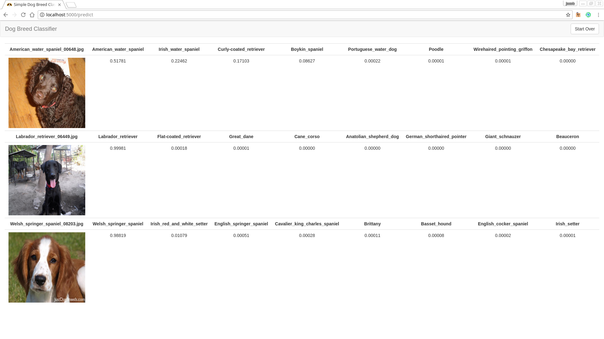

#Simple Dog Breed Classifier with Keras and Transfer Learning

## Instructions
1. Clone repo
	```
		git clone
		cd dog-breed-classifier
	```
2. Download necessary requirements
	```
		pip install -r requirements.txt
	```
3. Run
	```
		python app.py
	```
4. Browse to http://localhost:5000
5. Select Model To Use
6. Upload Image files

## Included Pre-trained Models
The included Inception and Resnet50 models were trained to predict dog breeds. On a test set, the Inception v3 model returned an accuracy of 74% while the Resnet50 was 84% accurate.

The architecture and weights files for the inception model include a beheaded inception v3 network with a GAP layer and two dense layers appended onto it.

The Resnet model's architecture file and weights are different. Instead, bottleneck features were calculated on the Resnet50 model which were then used as input into a smaller network. The smaller network consist of a flatten layer, dense layer(256 units) with relu activation, dropout(.4), and a dense layer with softmax activation.

### Use your own weights and model
You can replace the saved weights and model architecture in the `models` directory with your own. Note, that if you want to add any other model besides `Inceptionv3` or `Resnet50` then you'll need to add a `preprocess_<network>` function to `utils.py` as well as use it in `app.py`.

Also if you decide to use the full Resnet50 architecture and weights then you'll need to modify the `preprocess_resnet` function in `utils.py` because it extracts bottleneck features. 

## Screenshots


## Credits
Some inspiration and code came from:
- https://github.com/udacity/dog-project
- https://github.com/llSourcell/how_to_deploy_a_keras_model_to_production
- https://github.com/merantix/picasso